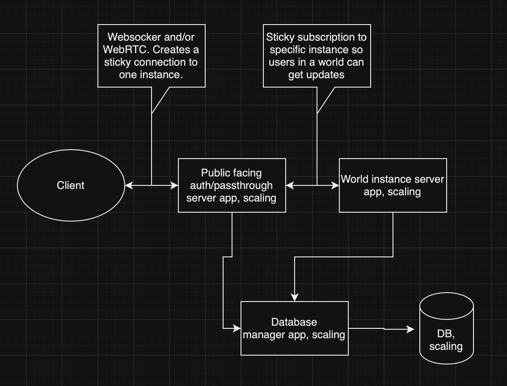

# Scaling Microservice Online Game
This is a scaling microservice online game project. The goal is to be highly scaleable, low latency, high throughput, support world instances, have a database layer, auth layer, local dev environment setup, and deploy infrastructure setup. Full CI/CD support. Support mobile, desktop, and web clients.

## General
We use flatbuffers for communication between client-server and server-server. This is for performance reasons.  
Install flatbuffers via homebrew `brew install flatbuffers`.  
Flatbuffer instructions: https://flatbuffers.dev/flatbuffers_guide_using_schema_compiler.html  

### Generate Dart Flatbuffer code
Run `flatc --dart -o ./Client/lib/generated_flatbuffers ./Flatbuffers/*`  
This will generate flatbuffer code for all files in the folder.

## Client
Written in Flutter, to support desktop/web/mobile.
Connects via WebRTC and Websocket for quick and reliable data transfer.

## Public Facing Auth/Passthrough Server
Written in Rust, highly scalable, handles sticky connections to players, takes care of authentication.

## World Instance Server
Each instance runs multiple worlds/levels. Players can enter the worlds/levels, send information, and be subscribed to get information from the worlds/levels. New worlds/levels can be created, they will be distributed to instances that have availability, new server instances will be spun up as needed.

## Database Manager Server
The database layer that other microservers call to write and read data to the database.

## Database
Stores the data used in the game.